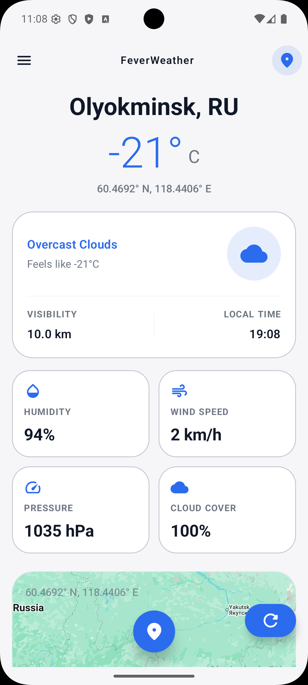
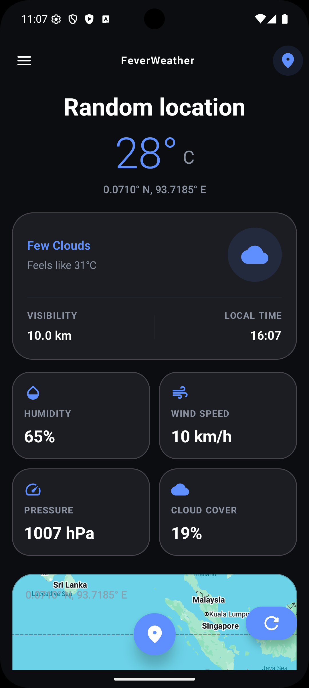
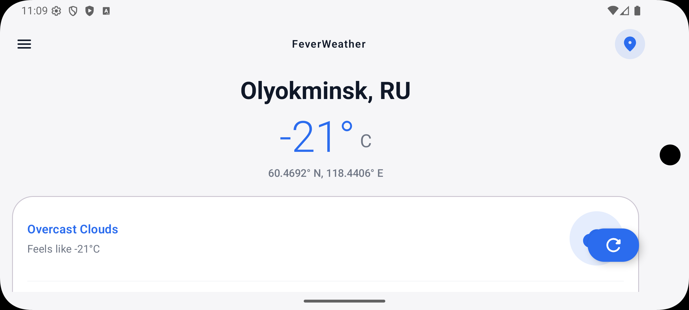

[English](README.md) | [Español](README.es.md)

# FeverWeather

Proposed solution for the Android Developer technical assessment at Fever.

## Table of Contents

- [Challenge](#challenge)
- [Quick Access](#quick-access)
- [Overview](#overview)
- [Screenshots](#screenshots)
- [APK](#apk)
- [Technical Stack](#technical-stack)
- [Architecture](#architecture)
- [Project Structure](#project-structure)
- [Setup / Configuration](#setup--configuration)
- [Build and Run](#build-and-run)
- [Testing](#testing)
- [Technical Decisions / Trade-offs](#technical-decisions--trade-offs)
- [Future Improvements](#future-improvements)
- [AI Usage](#ai-usage)

## Challenge

Build a single-screen Android app that generates a valid random latitude and longitude, fetches the current weather for that location using OpenWeather, displays the weather together with the location context, and allows the user to refresh the content to start again with a new random location.

## Quick Access

- APK: [artifacts/app-debug.apk](artifacts/app-debug.apk)
- Screenshots: [documentation/screenshots](documentation/screenshots)
- Source build requires `OPEN_WEATHER_API_KEY`.
- `MAPS_API_KEY` is intentionally not committed. When it is missing, the location card falls back to a visual placeholder instead of a live map.
- The included debug APK was generated to let reviewers validate the complete experience without local key setup.

## Overview

The challenge asks for a single-screen app that:

- generates valid random latitude and longitude values
- fetches weather for that location from OpenWeather
- displays weather plus location context
- supports refreshing to start again with a new random location

This implementation provides:

- automatic load on launch
- refresh through a floating action button
- loading, blocking error, and recoverable error states
- weather summary plus four secondary stats
- light mode, dark mode, and responsive landscape support
- a visual map card powered by Google Maps Lite Mode when a Maps key is configured

## Screenshots

| Light mode | Dark mode | Landscape |
| --- | --- | --- |
|  |  |  |

## APK

The repository includes a ready-to-install debug build at [artifacts/app-debug.apk](artifacts/app-debug.apk).

Install it with:

```bash
adb install -r artifacts/app-debug.apk
```

This path is useful for reviewers because the repository does not include the Google Maps API key. The APK allows the full app flow, including the live location map, to be reviewed without editing `local.properties`.

## Technical Stack

- Kotlin
- Jetpack Compose
- Material 3
- MVVM with unidirectional data flow
- `StateFlow` for screen state
- Dagger Hilt for dependency injection
- Retrofit + Gson + OkHttp
- Coroutines
- Google Maps Compose using Google Maps Lite Mode
- JUnit4 unit tests
- Compose UI tests
- Hilt-backed instrumentation integration tests

## Architecture

The app stays single-module on purpose to keep the solution proportional to the challenge while still following production-style layering and separation of responsibilities.

```text
UI -> ViewModel -> Repository -> OpenWeather API
```

Key decisions:

- `WeatherViewModel` owns screen state and exposes immutable `StateFlow<WeatherUiState>`.
- The UI only renders state and emits `WeatherUiAction`.
- `WeatherRepository` hides transport details and maps API payloads into app-facing models.
- Hilt wires the graph through a central module, which keeps dependencies explicit and testable.
- A load guard in the `ViewModel` prevents concurrent refreshes from triggering duplicated requests.

## Project Structure

```text
app/src/main/java/com/luisnavarro/fevertest/
  core/              # shared models, dispatchers, test runtime flags
  data/              # random location generation, repository, Retrofit API, remote DTOs
  di/                # Hilt modules and bindings
  feature/weather/   # route, screen, components, previews, state, actions, ViewModel
  ui/theme/          # Compose theme, colors, typography
app/src/test/        # unit tests
app/src/androidTest/ # Compose UI and integration tests
documentation/       # challenge instructions and screenshots
artifacts/           # installable APK
```

## Setup / Configuration

### Requirements

- Android Studio with Android SDK installed
- JDK 11
- Android 12+ emulator or device (`minSdk = 31`)

### local.properties

Create or update `local.properties` in the project root:

```properties
OPEN_WEATHER_API_KEY=your_openweather_key
MAPS_API_KEY=your_google_maps_key
```

Configuration notes:

- `OPEN_WEATHER_API_KEY` is required and the build fails fast when it is missing.
- You can use the challenge key described in [documentation/Instructions.md](documentation/Instructions.md) or your own OpenWeather key.
- `MAPS_API_KEY` is optional for source builds.
- Without `MAPS_API_KEY`, the location card shows the designed placeholder instead of the live map.
- If you generate your own Google Maps key, restrict it to the Android app package `com.luisnavarro.fevertest` and your signing SHA-1.

## Build and Run

```bash
./gradlew app:assembleDebug
./gradlew app:installDebug
./gradlew app:testDebugUnitTest
./gradlew app:connectedDebugAndroidTest
./gradlew app:lintDebug
```

Useful notes:

- `connectedDebugAndroidTest` requires a running emulator or connected device.
- Debug HTTP logs are available in Logcat with the tag `OpenWeatherHttp`.

## Testing

The project includes three complementary testing layers.

### Unit tests

Located in `app/src/test`.

They cover:

- random coordinate generation boundaries
- UI model formatting and title fallback rules
- `WeatherViewModel` success, refresh, failure, and concurrent refresh guard
- repository mapping and malformed payload handling

### UI tests

Located in `app/src/androidTest`, especially `WeatherScreenTest`.

They cover:

- loading state rendering
- blocking error rendering and retry action dispatch
- content rendering and refresh action dispatch

### Integration tests

Located in `app/src/androidTest`, especially `MainActivityWeatherTest`.

They cover the real Android flow:

```text
MainActivity -> Hilt -> WeatherViewModel -> fake repository/location generator -> UI
```

For stability, UI tests force the map card to use its placeholder instead of a live Google Map.

## Technical Decisions / Trade-offs

- Hilt was chosen over manual DI because it is easier to justify in a scalable Android codebase reviewed by multiple engineers.
- The app stays single-module because the challenge scope is one screen and modularization would add structure without current value.
- Google Maps Lite Mode was chosen instead of a fully interactive map because the design only needs visual context.
- `Local time` replaces `UV index` because the selected OpenWeather current weather endpoint does not provide UV data.
- The OpenWeather key is not committed anymore. Source builds require local configuration to keep credentials out of the repository.

## Future Improvements

- improve random generation so points are uniformly distributed across the globe
- add explicit OkHttp timeouts and retry policy decisions
- map country codes to localized country names
- expand instrumentation coverage for additional failure flows
- produce a signed release artifact instead of a debug APK

## AI Usage

AI assistance was used during development through OpenAI Codex / ChatGPT for:

- planning the backlog and implementation order
- challenging architectural trade-offs
- drafting and refining project documentation
- accelerating focused refactors and test scaffolding

All generated suggestions were reviewed, adapted, and validated manually. The final code, architecture choices, and test coverage were checked locally through Gradle build and test commands.
